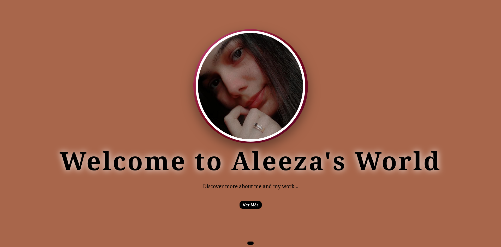

# 🎨 Aleeza Sajid - Portfolio

## Pagina principal

Este es mi portafolio personal, donde muestro mi trabajo como Web Developer.

## 🖼️ Capturas

Efecto Hover en Imagen de Perfil

## 📌 Características

- **Botón "Ver Más"**: Redirige al usuario a la página `home.html` para conocer más sobre Aleeza y su trabajo.
- **Botón de Cambio de Color**: Permite cambiar aleatoriamente el color de fondo de la página al hacer clic.
- **Imagen de Perfil**: Una imagen de perfil con un estilo atractivo.
- **Diseño Responsivo**: Adaptable a dispositivos móviles, tabletas y escritorios.
- **Animaciones Sutiles**: Efectos visuales suaves para una experiencia de usuario más atractiva.

## Funcionalidades

- Botón "Ver Más": Redirige a la página de inicio.
- Cambio de color de fondo: Un botón cambia el color aleatoriamente.
- Animaciones y transiciones: Efectos visuales en texto e imágenes.

## 🖱️ Botón de Cambio de Color

El botón de cambio de color aleatorio permite una interacción divertida con la   página, cambiando el color de fondo al azar cada vez que se hace clic.
Código JavaScript para Cambio de Color:

### Código JavaScript para Cambio de Color:

document.querySelector(".change-color").addEventListener("click", function() {
    document.body.style.backgroundColor = "#" + Math.floor(Math.random()*16777215).toString(16);
});

- Este código genera un color aleatorio en formato hexadecimal y lo aplica al fondo de la página.

## 🚀 Tecnologías utilizadas

- HTML5
- CSS3 (Animaciones y Media Queries)
- JavaScript (Eventos y Dinámica de la página)

# Pagina Inicio

Bienvenido a la página de inicio de Aleeza Sajid, una desarrolladora web con un portafolio que destaca proyectos, habilidades y experiencia en el desarrollo web.

## 🌟 Características

- **Sobre mí**: Una breve descripción de Aleeza Sajid, su trayectoria, y su pasión por el desarrollo web.
- **Habilidades**: Una lista de las principales tecnologías y herramientas que Aleeza utiliza, incluyendo HTML, CSS, JavaScript y más.
- **Proyectos destacados**:
  - **Landing Page SuccessHub**: Página que promueve herramientas para el éxito personal y profesional.
  - **Ghari Relojes**: Tienda online de relojes con catálogo, pagos seguros y guías de tallas.
  - **Bizballon**: Sitio web para la Federación de Balonmano Basauri.
- **Educación y Certificaciones**: Detalles sobre el curso de Desarrollo Web en Peñascal Kooperatiba.
- **Objetivo Profesional**: La meta de Aleeza para seguir aprendiendo y desarrollando soluciones web innovadoras.
- **Idiomas y Habilidades Blandas**: Idiomas y competencias en trabajo en equipo y resolución de problemas.
- **Proceso de Trabajo**: Las fases de desarrollo de Aleeza, desde planificación hasta publicación.

## Botones de navegación:

   - Go Back: Redirige al usuario de regreso a la página de inicio.
   - Contact Me: Redirige al usuario a la página de contacto.

# Página de Contacto

Esta es una página de "Contacto" diseñada con HTML y CSS. Permite a los usuarios ponerse en contacto proporcionando su nombre, correo electrónico y mensaje. La página también incluye enlaces a información de contacto como correo electrónico, LinkedIn, GitHub y número de teléfono.
## Características

- Información de Contacto: Muestra correo electrónico, LinkedIn, GitHub y número de teléfono.
- Formulario de Contacto: Un formulario para que los usuarios ingresen su nombre, correo electrónico y mensaje, que redirige a una página de agradecimiento tras la presentación.
- Diseño Adaptativo: Se adapta a diferentes tamaños de pantalla, desde escritorio hasta dispositivos móviles.
- Elementos Interactivos: Incluye efectos hover en botones y enlaces para una experiencia de usuario más dinámica.
- Pie de Página: Créditos y atribución del diseño en la parte inferior de la página.

## Tecnologías Utilizadas

- HTML: Estructura de la página.
- CSS: Estilización de la página y adaptabilidad.
- Flexbox: Diseño para alinear y distribuir el espacio entre los elementos.
- Media Queries: Asegura que la página sea compatible con dispositivos móviles.

# Página de Agradecimiento

Esta es una página de agradecimiento que se muestra después de que un usuario envía un mensaje a través del formulario de contacto. La página informa al usuario que su mensaje ha sido recibido y que se responderá lo antes posible. Además, ofrece un enlace para regresar a la página principal.
Características

- Mensaje de Agradecimiento: Un mensaje claro agradeciendo al usuario por su mensaje.
- Enlace para Regresar: Un botón que permite al usuario regresar a la página principal.
- Diseño Adaptativo: La página se adapta a diferentes tamaños de pantalla, con estilos optimizados para dispositivos móviles.
- Animaciones: Efectos de animación en la carga de la página, en el texto y en los botones.
- Efectos de Interacción: El contenedor principal y el botón tienen efectos hover para una experiencia más dinámica.

## Tecnologías Utilizadas

- HTML: Estructura de la página.
- CSS: Estilización de la página, incluyendo animaciones y efectos hover.
- Media Queries: Ajustes para hacer la página responsiva en dispositivos pequeños.

## 🚀 Tecnologías utilizadas

- **Frontend**: HTML5, CSS3, JavaScript
- **Diseño Responsivo**: Flexbox, Grid, Mobile-first
- **Herramientas**: Git, GitHub

## 📂 Estructura del Proyecto
/
- |-- index.html   # Archivo principal
- |-- style.css    # Estilos de la página
- |-- script.js    # Funciones interactivas

## ⚙️ Instalación y Uso

Clonar el repositorio
git clone https://github.com/Aleeza951/portfolio.git

## 🖥️ Responsive Design

- El portafolio es totalmente responsivo y se adapta a:

✅ Móviles 
✅ Tablets 
✅ Escritorio

## 🔗 Enlaces

Portafolio en vivo: Mi Portafolio

GitHub: Aleeza Sajid